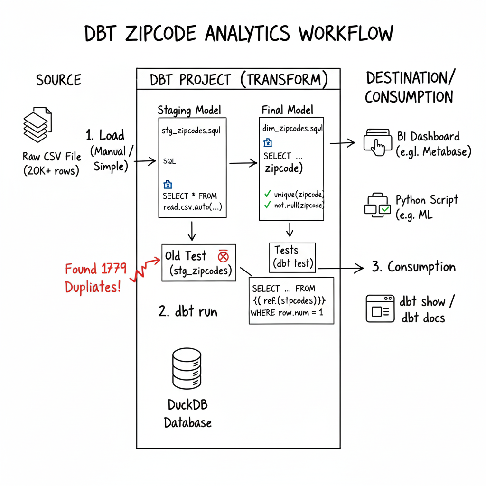

# My First dbt Core Project: Zipcode Data Analytics

This is a complete, end-to-end data engineering project that demonstrates the core workflow of building, testing, and cleaning a data model using **dbt Core** and **DuckDB**.

## Project Architecture

## Project Workflow
This project takes a raw, messy CSV file of zipcode data and transforms it into a clean, de-duplicated, and tested analytical table.

### Key dbt Features & Concepts Demonstrated
* **Project Setup**: Initializing a dbt project from scratch.
* **Data Loading**: Ingesting a large external CSV file directly within a dbt model using DuckDB's `read_csv_auto` function.
* **Layered Data Modeling**: Building a dependency between a staging model (`stg_zipcodes`) and a final, clean dimension model (`dim_zipcodes`).
* **Data Testing**: Implementing built-in `unique` and `not_null` tests to validate data quality and drive development.
* **Advanced SQL for Cleaning**: Using the `ROW_NUMBER()` window function for a robust de-duplication of the source data.
* **Git Workflow**: All work was developed on a feature branch and saved with a descriptive commit message.

### Technologies Used
* dbt Core
* DuckDB
* Git & GitHub

### How to Run This Project
1.  **Prerequisites**: Ensure you have Python, pip, and Git installed.
2.  **Clone the repository**: `git clone <your-repo-url>`
3.  **Install dependencies**: `pip install dbt-core dbt-duckdb`
4.  **Build the models**: `dbt run`
5.  **Run the tests**: `dbt test`